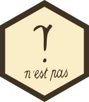

nestpas 
=================================================

The `nestpas` package provides a set of pipe-friendly 
aliases for a variety of operators. Previously these were
a part of the [`magrittr`](https://github.com/tidyverse/magrittr)
package.

The following aliases are defined:

```R
`+`            add	                    
`&`            and
`/`            divide_by	              
`%/%`          divide_by_int	
`==`           equals	                
`[`            extract	                      
`[[`           extract2	                  
`[<-`          inset	                    
`[[<-`         inset2	                
`%in%`         is_in                 	
`>`            is_greater_than	        
`<`            is_less_than	          
`>=`           is_weakly_greater_than	
`<=`           is_weakly_less_than	    
`%%`           mod	                    
`*`            multiply_by	            
`%*%`          multiply_by_matrix	    
`!`            not / `n'est pas`
`|`            or	                    
`^`            raise_to_power	        
`attr<-`       set_attr                 
`attributes<-` set_attributes           
`colnames<-`   set_colnames
`comment<-`    set_comment 
`class<-`      set_class
`dim<-`        set_dim 
`names<-`      set_names	           
`rownames<-`   set_rownames	          
`-`            subtract	              
`$`            use_series	            
```
